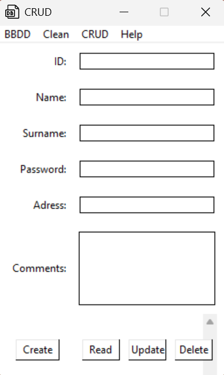

## Tkinter-CRUDM

#### Description
A simple functional CRUD using Python and Tkinter.

#### WARNING!!!
***SQLite is requiered***
***This CRUD was mostly created from a tutorial!***
***Expect errors!***

#### Credits
Tutorial Source [pildorasinformaticas](https://www.youtube.com/watch?v=E0OqddzjFUY&list=PLU8oAlHdN5BlvPxziopYZRd55pdqFwkeS&index=63 "pildorasinformaticas CRUD Tutorial").

> Unknown Date
